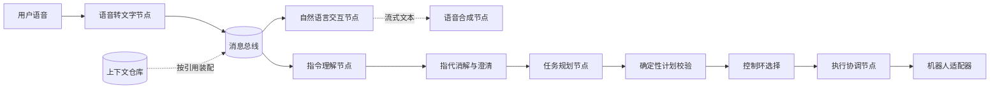

# BusAgent

BusAgent 是一个面向机器人与实时人机交互场景的总线式多智能体框架。它将任务规划、自然语言交互、感知、执行和语音合成等能力拆分为可寻址节点，让消息通过总线并行、流式且有序地流转。

> 当前状态：已经具备可运行的 Host、Web 语音界面和机器人指令纵向链路。`find`、`track`、`cancel/hold`、`status_query` 可通过 HTTP 适配器驱动 LiuGongArm 的视觉跟随控制器；抓取和放置已有结构化规划与校验，但底层控制技能尚未实现，因此会明确返回失败，不会伪报完成。

## 为什么需要 BusAgent

传统 Agent 通常由一个主模型维持上下文、决定工具调用，并以近似线性的方式推进任务。这种方式易于起步，但在机械臂等实时系统中会逐渐暴露问题：

- 规划、感知、执行和人机沟通彼此等待，端到端延迟被串行步骤累加；
- 完整文本生成后才进入语音合成，无法充分利用流式输出；
- 主模型承担过多上下文和工具决策，既昂贵，也容易误用能力；
- 多条用户指令同时到达时，任务之间的顺序、资源占用和取消关系难以维护；
- 机械臂执行器只能顺序执行，但感知、规划和回复生成又适合并行，两类约束很难放进同一条线性链路。

BusAgent 的核心判断是：许多智能任务的具体内容不同，但处理步骤、节点职责和转移条件具有稳定结构。与其让一个主 Agent 重复协调所有步骤，不如让每个专职节点依据明确的契约、提示词和策略，自主决定下一跳，并由总线维护消息身份、顺序和上下文关联。

## 核心理念

| 理念 | 含义 |
| --- | --- |
| 总线驱动 | 节点通过统一消息总线解耦，不依赖固定的点对点调用链。 |
| 职责明确 | 规划、对话、感知、执行、安全等能力由专职节点承载。 |
| 并行优先 | 无资源冲突的工作可同时推进，例如规划与首次语音反馈。 |
| 流式优先 | 节点可声明流式输入或输出，让下游尽早开始处理。 |
| 有序可追踪 | 每条指令和派生消息都有稳定标识、关联关系和序号。 |
| 上下文按需装配 | 消息只引用所需上下文分块，节点请求时再自动装配。 |
| 监督而非包办 | 监督节点审查路由和策略，不重新成为承担全部工作的主 Agent。 |

## 一个典型流程

用户说：“帮我找到绿色的咖啡杯并递给我。”



语音被转写后，同时进入对话和快速打断监听；完整指令依次经过结构化理解、指代消解、技能规划、确定性校验和控制环选择。只有经过校验的当前任务版本才会由执行协调节点交给设备适配器。机械臂执行仍按 `arm-01` 资源车道串行进行，普通对话和语音反馈无需同步阻塞。

## 架构概览

BusAgent 由以下逻辑组件组成：

- **消息总线**：接收、编号、路由和投递消息，维护关联关系与交付状态；
- **能力节点**：执行单一或紧密相关的职责，可由模型、传统算法、硬件驱动或人工确认实现；
- **任务规划节点**：把意图转换为带依赖与条件的任务计划，并随结果更新计划；
- **执行协调节点**：管理共享资源、串行执行单元、取消和抢占；
- **监督节点**：检查下一跳、权限、安全策略和上下文使用，并提供受控修正；
- **上下文仓库**：保存可版本化的上下文分块，通过引用按需注入节点请求；
- **可观测性组件**：把一次用户指令下的消息、节点决策和执行结果串成完整轨迹。

详细设计见 [架构说明](docs/architecture.md)。

## 设计边界

BusAgent 重点解决：

- 低延迟、多节点并行的人机交互；
- 流式内容在不同能力节点之间传递；
- 并行计算与独占硬件资源的统一编排；
- 多任务并发下的消息关联、排序、取消和恢复；
- 小模型、传统算法和硬件执行器的协同；
- 节点级上下文控制、安全审查与运行轨迹追踪。

当前不试图解决：

- 替代 ROS 2、DDS、MQTT、Kafka 等成熟通信或机器人中间件；
- 用语言模型绕过机械臂控制器的实时控制与功能安全边界；
- 保证任意模型输出天然可靠；
- 把所有任务都强行拆成并行节点；
- 在设计阶段绑定某一种模型供应商、消息中间件或部署平台。

## 文档导航

- [精细化节点与插件划分](docs/123.md)：职责节点、技能插件、控制环和演进方向；
- [后端架构](backend/README.md)：Package、App、事件总线和运行时边界；
- [首版实现规格](backend/IMPLEMENTATION_SPEC.md)：Host 和语音链路的可执行规格；
- `backend/backend-config/apps/desktop-robot.app.json`：当前机器人 App 的真实节点和路由；
- `backend/src/apps/desktop-robot/skill-catalog.ts`：当前技能契约、前后置条件和默认控制环。

## 本地体验

无需数据库或 Docker。事件、任务、幂等键和投递状态仅保存在当前进程内，重启后清空；外部 Agent 需重新注册。

```bash
cd backend
export DASHSCOPE_API_KEY=sk-你的key
pnpm install
pnpm dev
```

后端不托管前端页面。另开一个终端启动 React 前端：

```bash
cd frontend
pnpm install
pnpm dev
```

打开 [http://localhost:5173/](http://localhost:5173/) 进入 App 首页。详细说明见 [frontend/README.md](frontend/README.md)。

若要让机器人命令实际生效，还需先启动 LiuGongArm 的 `run_vision_follow`，使控制 API 监听 `127.0.0.1:7861`。当前可直接说“找红色方块”“跟踪电钻”“停一下”“现在什么状态”。

## 项目阶段

当前是机器人闭环的第一阶段纵向切片：先让语音、结构化指令、技能计划、校验、执行状态和真实控制 API 连通。已交付的是视觉目标选择与跟随，不是完整抓取系统。下一阶段应按 `docs/123.md` 接入 SceneGraph、自由空间运动规划、精细操作策略和结果验证器，再开放 `plan_grasp`、`move_to`、`grasp`、`transport`、`place` 等技能。

## 参与讨论

架构变化应说明使用场景、失败模式、延迟收益和对控制闭环的影响。节点按职责命名，模型和硬件实现作为可替换 Provider；技能作为带前后置条件的插件，不作为任意自然语言动作。

## 许可证

项目尚未选择开源许可证。在许可证确定前，仓库内容默认保留全部权利，不应被视为已经获得复制、修改或分发授权。

## 固定工业场景演示

支持保留真实语音与语义决策、使用固定动作完成金属柱篮内码放，并调整动态散料数量进行压力测试。启动和测量方式见 [工业演示说明](docs/industrial-demo.md)。
