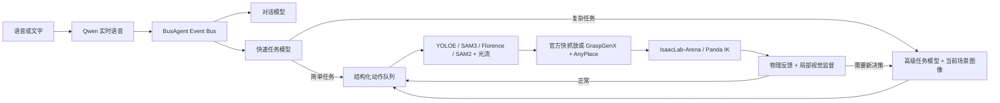

# 刘工智能 · BusAgent + IsaacLab-Arena + Franka Panda


刘工智能是一套面向工业桌面操作的分层机器人系统。当前主线以 **Isaac Sim 6.0.1、IsaacLab-Arena 和 Franka Panda** 为统一仿真执行底座，以 **BusAgent + Mastra** 管理对话、任务规划、结构化任务队列、上下文、工具调用和异步监督。

系统的职责边界是：**BusAgent 负责信息传递和任务状态，任务模型负责决定做什么，GraspGenX 负责困难物体怎么抓，AnyPlace 负责复杂关系怎么放，Arena 负责让 Panda 执行并用物理证据验收。**

## 架构



一次输入会同时进入对话和任务通道。对话模型负责即时反馈；任务模型只判断是否需要执行，并为明确的简单任务一次生成完整动作序列。整理、装箱、插入、套柱、悬挂、数量选择、姿态约束和空间指代等复杂任务进入高级模型，高级模型读取冻结的当前场景图像并生成分阶段动作列表。

任务列表使用 JSON 动作，不用自然语言驱动执行器。一抓一放为一个阶段；阶段可以声明依赖关系、快慢环策略、最大尝试次数和局部监督条件。没有依赖的阶段连续执行，Florence 检查可异步返回；存在依赖时，后续阶段等待当前检查。只有失败、未知状态或最终复查需要重新调用高级模型。

BusAgent 的记忆节点保存事件事实；上下文压缩节点按不同 token 预算生成本地抽取式视图，`model_calls=0`，不会调用云模型。Mastra 提供模型工具调用和结构化决策边界，BusAgent 保留事件路由、幂等、队列、物理状态和审计。

## 快慢环

| 层级 | 默认能力 | 使用时机 |
|---|---|---|
| 视觉快环 | YOLOE 文本/视觉提示、SAM2 Tiny、LK 光流 | 已知或可提示目标的快速定位、分割和持续跟踪 |
| 视觉慢环 | SAM3 开放词汇定位，Florence-2 描述、框选和局部验收 | 快环置信度不足、陌生目标、关系判断和结果检查 |
| 视觉语义增强 | 支持原生框选的多模态模型 | 复杂任务中按位置、状态或关系选择具体实例 |
| 运动快环 | Arena 官方 Panda IK 与快速抓放 | 普通方块、圆柱和明确支撑面 |
| 运动慢环 | GraspGenX 抓取、AnyPlace 放置 | 陌生物体、杂乱抓取、插入、套柱、悬挂和精确放置 |

`fast_only` 失败后直接返回；`fast_then_slow` 先走官方快环，再按失败阶段升级；`slow` 直接调用增强模型。已经确认抓住物体后只升级放置，不重新抓取。物理成功但视觉检查不确定时保留动作结果，通过观察或监督补证，不盲目重放。

## 模型与权重

### 本地模型

| 模型 | 作用 | 默认位置或配置 |
|---|---|---|
| YOLOE | 快速开放词汇检测与视觉提示重识别 | `_models/yoloe-26x-seg.pt` |
| SAM2 Tiny | 当前框精化、分割和跟踪 | `_models/sam2/sam2.1_hiera_tiny.pt` |
| SAM3 | 慢环开放词汇定位 | `_models/sam3.pt` |
| Florence-2 | 场景描述、最终定位回退、局部结果验收 | `_models/florence-cache/snapshots/<snapshot>` |
| MobileCLIP2 | YOLOE 视觉提示编码 | `_models/mobileclip2_b.ts` |
| GraspGenX | 通用 6DoF 抓取候选 | `_models/graspgenx/checkpoints/release` |
| AnyPlace | 6DoF 放置候选与接触关系 | 由 `_envs/anyplace` 和 `_vendor/anyplace` 提供 |

模型目录、虚拟环境和运行输出不提交到 Git。GraspGenX、AnyPlace、视觉服务和 Isaac Sim 使用隔离的 Python 环境，避免 CUDA、Torch 和 Isaac 扩展互相覆盖。

### 云端模型角色

模型可以在工作台右上角的“设置 → 模型”中配置，无需改代码。每个 Profile 可设置 Provider、API 地址、模型名、API Key、视觉能力、原生框选能力、首字超时、总超时、思考强度和冷却开关；每个节点可单独指定主模型、备选顺序与回退策略。

当前推荐配置如下：

| 角色 | 推荐模型 | 说明 |
|---|---|---|
| `task` | 快速文本模型或 Gemini Flash | 对单句输入分类；简单任务一次生成完整序列，默认不读图 |
| `planner` | Gemini 3.7 Flash | 复杂任务读取场景图像、生成阶段和可选 `box_2d` |
| `visual` | Gemini 3.7 Flash | 仅在本地视觉仍有实例歧义时进行图像框选 |
| `supervisor` | Gemini 3.7/3.8 Flash | 失败恢复与最终列表复查；日常阶段优先使用物理反馈和 Florence |
| `dialogue` | Qwen 3.8 Flash | 用户对话；连续失败三次后永久切换到下一备选，直到前端手动切换 |
| STT/TTS | Qwen 实时语音模型 | 独立语音协议，不随规划模型切换 |

Gemini 3.8 Flash 适合作为同能力备选。DeepSeek 等纯文本模型可以替换快速任务模型、文本监督或对话模型；如果用于高级规划，系统会失去直接看图和原生框选能力，此时目标选择依赖 YOLOE → SAM3 → Florence 以及结构化场景摘要。`same_capability` 策略不会把需要视觉/框选的请求回退到纯文本模型。

不要把密钥写入 README 或提交到仓库。首次启动可用环境变量注入，再在前端保存：

```bash
export GEMINI_PRIMARY_URL=https://provider.example/v1
export GEMINI_PRIMARY_API_KEY=...
export GEMINI_SECONDARY_URL=https://backup.example/v1
export GEMINI_SECONDARY_API_KEY=...
export QWEN_CHAT_URL=https://provider.example/compatible-mode/v1
export QWEN_CHAT_API_KEY=...
export DASHSCOPE_API_KEY=...        # Qwen STT/TTS
```

BusAgent 的运行配置保存在 `BusAgent/backend/.local/intelligence.json`。前端设置会更新这份配置；可配置项包括：

- `roles`：任务、规划、视觉、监督和对话节点的默认模型；
- `fallbacks` / `fallbackPolicies`：备选顺序与 `disabled`、`same_capability`、`ordered_compatible`；
- `nodeFirstTokenTimeouts` / `nodeTimeouts`：各节点首字和总超时；
- `performance`：预规划、请求预算、工具轮数和 Provider 冷却；
- `architecture.mode`：`staged` 新架构与 `legacy` 兼容路径；
- `stageRetryLimit`、`finalReviewLimit`、`supervisorEnabled`：阶段重试和监督策略。

## 目录

```text
LiuGongArm/
├── BusAgent/                   # 独立 Git 子模块：事件总线、Mastra、任务队列和工作台
├── configs/                   # Panda、相机、视觉、抓取和放置配置
├── configs/scenes/            # sorting / packing / assembly / machining / tools 等场景
├── source/mr_liu/arena/       # Arena Panda 控制器、观测、物理验收和视觉引用
├── source/mr_liu/grasp/       # GraspGenX 接入与抓取执行
├── source/mr_liu/place/       # AnyPlace 接入、放置几何和接触关系
├── source/find_and_track/     # YOLOE、SAM2、光流和 Florence
├── scripts/                   # 服务启动、验证和验收脚本
├── ops/                       # Supervisor、Nginx、场景切换和开机自启
└── tests/                     # 无 GUI 单元与集成测试
```

## 获取代码

```bash
git clone --recurse-submodules https://github.com/yibent/LiuGongArm.git
cd LiuGongArm
git submodule update --init --recursive
```

要求：

- NVIDIA GPU 与可用的显示服务；
- Isaac Sim `6.0.1.0`，Python 3.12；
- Node.js `>=22.13`、pnpm `11.9`；
- MariaDB，默认监听 `127.0.0.1:3307`；
- `_envs/vision`、`_envs/graspgenx`、`_envs/anyplace`、`_envs/arena`；
- `_vendor/IsaacLab-Arena`、`_vendor/GraspGenX`、`_vendor/anyplace` 和上表权重。

BusAgent 首次构建：

```bash
cd BusAgent/backend
pnpm install --frozen-lockfile
pnpm build

cd ../frontend
pnpm install --frozen-lockfile
pnpm build
cd ../..
```

## 启动

### 云服务器或完整工作站

项目提供统一服务管理器。已安装 Supervisor 配置时，以下命令会转交给 Supervisor；否则按独立进程启动服务：

```bash
cd /path/to/LiuGongArm
python3 ops/arena_stack.py start
python3 ops/arena_stack.py status
```

完整冷启动（包含 MariaDB）和状态检查：

```bash
supervisorctl -c ops/arena-supervisord.conf start all
supervisorctl -c ops/arena-supervisord.conf status
```

启动指定场景并记住该选择：

```bash
python3 ops/arena_stack.py --config configs/scenes/packing.json start arena
```

停止或重启单个服务：

```bash
python3 ops/arena_stack.py stop arena busagent
supervisorctl -c ops/arena-supervisord.conf restart vision
supervisorctl -c ops/arena-supervisord.conf restart busagent
```

服务启动顺序和默认端口：

| 服务 | 端口 | 启动入口 |
|---|---:|---|
| MariaDB | 3307 | Supervisor `database` |
| 视觉链路 | 5570 | `scripts/run_arena_vision.sh` |
| GraspGenX | 5556 | `scripts/run_graspgenx_server.sh` |
| AnyPlace | 5590 | `scripts/run_anyplace_server.sh` |
| Arena + Panda | 7861 | `scripts/run_arena_panda.sh --viz kit` |
| BusAgent Backend | 3100 | `node BusAgent/backend/dist/main.js` |
| 刘工智能工作台 | 8991 | Nginx，配置见 `ops/arena-nginx.conf` |
| Isaac 观察页 | 8993 | Nginx 只读预览 |
| 工作台备用入口 | 8999 | Nginx 镜像入口 |

### 手动分服务启动

调试时按顺序在不同终端运行：

```bash
bash scripts/run_arena_vision.sh
bash scripts/run_graspgenx_server.sh
bash scripts/run_anyplace_server.sh
bash scripts/run_arena_panda.sh --viz kit

cd BusAgent/backend
BUSAGENT_PORT=3100 BUSAGENT_ROBOT=franka_panda node dist/main.js
```

前端生产文件由 Nginx 从 `BusAgent/frontend/dist` 提供。本地前端开发可运行：

```bash
cd BusAgent/frontend
BUSAGENT_PROXY_TARGET=http://127.0.0.1:3100 pnpm dev
```

远程服务器建议通过 SSH 隧道映射到本机：

```bash
ssh -N \
  -L 18991:127.0.0.1:8991 \
  -L 18993:127.0.0.1:8993 \
  -L 18999:127.0.0.1:8999 \
  -p <ssh-port> <user>@<server>
```

随后打开 `http://127.0.0.1:18991/?workspace=1`。场景切换会停止执行、清空当前场景的任务/记忆/视觉运行数据并从初始状态加载新场景；前端会在切换前要求确认。

### 开机自启

云实例使用 `ops/arena-cloud-boot.conf` 启动项目专用 Supervisor。安装方式、进程恢复、日志位置和注意事项见 [云服务器自启](docs/arena/AUTOSTART.md)。Supervisor 管理业务服务，Nginx 和桌面显示继续由云平台提供。

## 验证

```bash
# Python
PYTHONPATH=source python3 -m pytest -q

# BusAgent Backend
cd BusAgent/backend
pnpm test
pnpm build

# BusAgent Frontend
cd ../frontend
pnpm test
pnpm build
```

工业场景端到端验收入口：

```bash
PYTHONPATH=source python3 scripts/run_industrial_acceptance.py \
  --arena http://127.0.0.1:7861 \
  --bus http://127.0.0.1:3100
```

当前代码支持普通抓放、独立抓取后续放置、自由表面放置、分格容器空格选择、紧凑装盘，以及由 AnyPlace 驱动的 `insert`、`sleeve_on_peg` 和 `hang` 接触关系。最终结果必须以当前测试报告和物理反馈为准；“接口支持”不代表任意几何与任意初始姿态都能一次成功。

## 相关文档

- [Arena Panda 适配](docs/ARENA_PANDA_ADAPTATION.md)
- [快慢环](docs/FAST_SLOW_LOOPS.md)
- [视觉链路](docs/ARENA_VISION_PIPELINE.md)
- [云服务器自启](docs/arena/AUTOSTART.md)
- [BusAgent Backend 架构](BusAgent/backend/README.md)
- [AnyPlace 放置](docs/ANYPLACE_PLACEMENT.md)
- [GraspGenX 服务](docs/GRASPGENX_SERVER.md)

历史 SO-101、FineGrasp 和早期 Florence/YOLOE 实验仍保留在 `docs/`，但不再作为当前主线的启动或能力说明。
