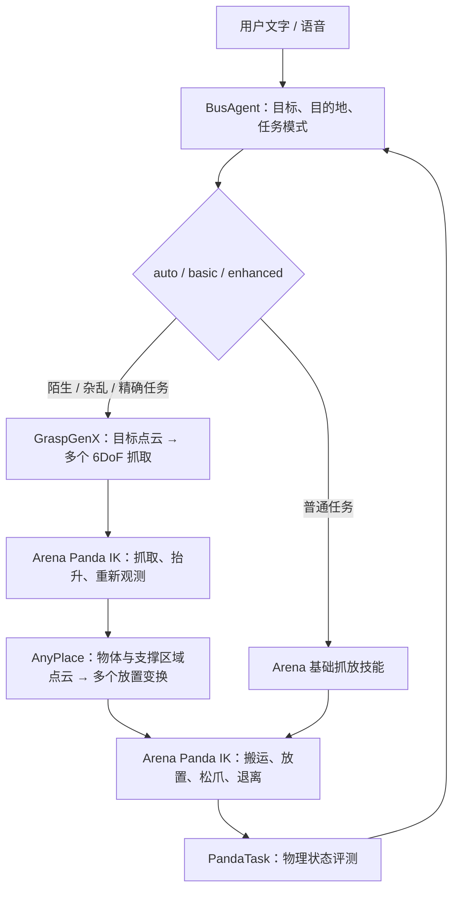

# LiuGong · Arena / Panda 抓放适配

本分支基于 `codex/official-franka-progress` 的 `0576d673fa396d1373d9bcd298d45a93bc582904`，增加独立的 Arena 执行入口。服务器部署目录为 `/root/gpufree-data/arena-panda`；原 `/root/gpufree-data/LiuGongArm` 保留。

## 已实现的责任边界



- 场景、官方 Franka Panda、相机和动作管理来自 IsaacLab-Arena。机械臂由官方 `DifferentialInverseKinematicsActionCfg` 求解，项目只组织笛卡尔路径点和抓放步骤。
- `auto` 在 `unfamiliar / cluttered / precise` 为真时启用增强路径。`basic` 不调用学习模型；`enhanced` 必须调用 GraspGenX 和 AnyPlace，失败时不会伪装成基础路径成功。
- BusAgent 下发一次完整 `pick_place` 事务，含目标和目的地标签，不生成 XYZ、机械臂关节角或抓放姿态。
- GraspGenX 与 AnyPlace 分别运行在 Python 3.11 模型环境。Isaac/Arena 使用独立 Python 3.12 环境，通过 ZMQ / HTTP 通信。
- 相机、物理状态和 IK 只在仿真主线程访问。模型推理在工作线程等待时，仿真持续步进。命令去重账本禁止同一 `command_id` 重复执行；重启后未完成任务标记结果未知，不重放。

## 已删掉的重复要求

已删除 BusAgent 每任务 64 条事件的路由上限，避免长任务进度消息耗尽计数后丢失最终成功/失败事件。Panda 路径不再使用旧机械臂的抓取准备确认、恢复确认提示、假定相机已就绪的状态机，以及候选姿态的俯视角度、工作空间、重复点数和位移门槛。BusAgent 只校验语义任务字段，Arena 承担实际执行与结果评测。语言模型暂时不可用时，已解析完整的文字任务继续执行。保留命令去重、停止和必要的消息格式检查，避免网络重试重复驱动同一机械臂。

## 坐标约定

所有几何采用米，传递完整 SE(3) 齐次变换。IsaacLab 3 的四元数顺序为 **XYZW**。

GraspGenX 的 Panda 描述为 80 mm 开口、103.4 mm 指尖深度。模型夹持轴 X 与 Panda 手部夹持轴 Y 相差绕 Z 的 +90°；执行 TCP 为 `panda_hand` 局部 Z 上 103.4 mm。利用平行夹爪绕接近轴 180° 的对称性选择等效腕部朝向。

AnyPlace 输出的是作用于输入物体点云的变换，并非末端绝对姿态：

```text
T_world_object_final = relative @ T_world_object_input
T_world_tcp_goal = T_world_object_final @ inverse(T_tcp_object)
```

输入物体参考系与持物变换在抬升后的 RGB-D 观测上建立，持物阶段融合工作区、侧面与腕部三个视角，以缓解夹爪遮挡。腕部相机显式启用 `update_latest_camera_pose=True`，使每帧深度使用更新后的相机外参。候选保留完整旋转，按腕部转动幅度、平移距离和模型抓取分数排序；没有手写工作空间、俯视角度、放置高度或区域边界的硬拦截。区域和支撑关系由任务执行后的物理评测判断。

## 运行

已部署机器的依赖位于 `_envs`、`_vendor` 和 `_models`；精确源码版本见 [版本清单](arena/versions.json)，`docs/arena/*-environment.txt` 是已部署环境快照（含继承包与本地 editable 路径），用于排查版本差异，并非跨机器直接安装的锁文件。BusAgent 的 `.env` 仅在服务器保存，使用独立 `busagent_arena` 数据库，连接本机 MariaDB 3307。

```bash
cd /root/gpufree-data/arena-panda
python3 ops/arena_stack.py start
python3 ops/arena_stack.py status
# 重启会重新生成仿真场景。
python3 ops/arena_stack.py stop arena
python3 ops/arena_stack.py start arena
```

管理脚本仅管理其启动的进程组。日志与 PID 记录在 `output/services/`。数据库和 Nginx 由系统独立管理。

直接运行单项回归：

```bash
bash scripts/run_arena_panda.sh --smoke --mode basic --viz kit
bash scripts/run_arena_panda.sh --smoke --mode enhanced --viz kit
```

服务器的 Isaac Sim 为 **6.0.1-rc.7**。已处理版本兼容问题：Lab 接管 PhysX 前关闭 Sim 的重复初始化回调；用生产资产库的 `FrankaRobotics/FrankaPanda/franka.usd` 替换已经失效的 staging Panda 路径。接触传感器使用 `patches/isaaclab-sim6-contact-import.patch` 修正 Sim 6 的模块路径（在 IsaacLab 源码目录运行 `git apply --unidiff-zero` 应用）。下降放置使用 Lab 的接触传感器判断物体接触指定支撑面后松爪，避免继续压向模型目标。该机器的无界面模式无法返回深度，当前使用已有 X11 `:20` 的 `--viz kit`。这是实际验证过的运行模式。

## 网页与接口

| 端口 | 服务 |
| --- | --- |
| 8991 | BusAgent Panda 控制台，`/v1/` 代理后端，`/preview/` 打开观察台 |
| 8993 | 三路实时 RGB-D 相机观察台，仅代理只读状态和图像 |
| 8999 | 预留，未占用 |
| 127.0.0.1:7861 | Arena 任务接口 |
| 127.0.0.1:5556 | GraspGenX ZMQ |
| 127.0.0.1:5590 | AnyPlace HTTP |
| 127.0.0.1:3100 | BusAgent 后端 |

Nginx 配置在 `ops/arena-nginx.conf`。云平台以 HTTPS 域名代理这些端口，直接 IP:8991 不可达。已验证的公网入口：

- [BusAgent 控制台](https://8byr7v21-8qne20ga-8991.zj02restapi.gpufree.cn:8443/)
- [Isaac 三路相机观察台](https://8byr7v21-8qne20ga-8993.zj02restapi.gpufree.cn:8443/)

当前电脑也保留 SSH 隧道 `http://127.0.0.1:18991/` 和 `http://127.0.0.1:18993/`。

```bash
curl http://127.0.0.1:7861/api/status
curl -X POST http://127.0.0.1:7861/api/command \
  -H 'Content-Type: application/json' \
  -d '{"command_id":"demo-001","skill":"pick_place","params":{"target":{"category":"red block"},"destination":{"label":"blue pad"},"mode":"enhanced"}}'
curl http://127.0.0.1:7861/api/commands/demo-001
```

HTTP 202 仅表示接受任务。最终 `completed` 必须来自物理评测；失败或停止时返回 `failed / cancelled`。评测检查实际抬升、夹爪张开、末端退离、物体完整落在区域内、底面支撑高度、稳定性和线速度。每次任务保存 JSON 及三路图像到 `output/arena/`。

## 当前验证范围

这是分层架构的第一版仿真集成，当前场景是红色方块、黄色圆柱与蓝色支撑垫。普通抓放已通过公网网页下发的完整事务，红方块距区域中心约 1.2 mm；GraspGenX + AnyPlace 红方块增强流程也已完成真实抓起、接触放置、释放、退离和稳定性验证。黄色圆柱增强抓放也通过公网网页端到端验证：抬升 16.0 cm，落点距区域中心 3.9 mm，聊天收到真实完成结果。BusAgent 195 项测试、Arena 10 项测试和前端构建通过。开发回归记录见 `docs/arena/validation.json`，其中保留了修复前的失败记录。

以下能力尚不能宣称已完成：

- **VLA 策略尚未加载。** 普通路径使用 Arena IK 技能，接口明确返回 `vla_loaded=false`。
- **当前分割使用仿真语义标签。** 深度来自真实渲染相机，未用网格采样或重复点补足输入；分割仍是基准提供的标签，尚未接入开放词汇视觉分割。
- **当前评测场景为支撑面放置。** 默认差分 IK 是局部控制器，模型候选可能到达关节极限；复杂场景仍需接入成熟运动规划器和相应 Arena 任务。这里没有自研关节控制器或宣称已经实现完整机械臂避障。
- **AnyPlace 没有学习成功概率或碰撞保证。** 只将其作为姿态提议器，以执行后物理评测确认结果。
- **尚无陌生工业物体数据集的成功率。** 示例测试不能外推为工业鲁棒性；需要继续接入工业 USD 资产、杂乱场景、随机姿态、多目标整理和遮挡回归。
- 失败时可能保持持物；当前没有自动恢复或自动松爪。重启会重建场景并保留旧命令的未知结果记录。

## 参考实现

- [IsaacLab-Arena](https://github.com/isaac-sim/IsaacLab-Arena)
- [GraspGenX](https://github.com/NVlabs/GraspGenX)
- [AnyPlace](https://github.com/ac-rad/anyplace)
- [AnyPlace 官方权重](https://huggingface.co/datasets/yuchiallanzhao/anyplace)

AnyPlace multitask 权重 SHA-256：`d3d33f0a279633c25f252960a208d4b4447a756f0cff8e94be0faadc20dc5be5`。模型源码、权重和 Python 环境不提交到仓库。
