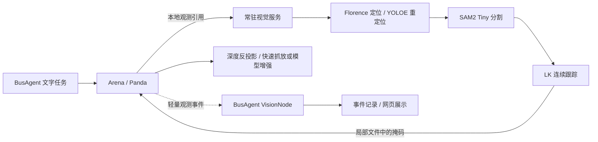

# Arena 图像链路

2026-09-06：恢复原仓库 Florence-2、YOLOE、SAM2 Tiny、LK 光流组件。SAM3 暂不启用。图像不进入 BusAgent 的语言模型上下文。



实际调用不等待 BusAgent 分发：Arena 主线程冻结 RGB、深度、内参和外参，写入同机 `output/perception/<request_id>/`；工作线程向 `127.0.0.1:5570/observe` 发送观测编号。视觉服务读取 RGB，结果掩码保存在同一观测目录，Arena 使用该帧的深度和外参重建点云。图像数据和掩码不经过 BusAgent，也不会打包进语言模型消息。Florence 自身作为视觉模型接收 RGB，与上层对话模型分开。

设备适配节点轮询任务进度时，将新观测的编号、标签、模型阶段、框坐标、耗时与成功/失败发布为 `perception.observed`。名义视觉节点生成 `perception.reported`，保留 task / correlation / causation 关联。报告只记录和展示，没有到对话或指令理解节点的路由。

## 推理与相机选择

- 首次观测：Florence 开放词汇定位 → YOLOE 视觉提示匹配 → SAM2 Tiny 掩码。
- 连续观测：优先 LK 前后向光流；每 8 次跟踪后重新分割。光流丢失时使用视觉参考图让 YOLOE 重定位，必要时重新调用 Florence。网络权重常驻 GPU，不按帧装卸模型。
- 抓取前使用两台固定相机。持物后优先腕部相机，腕部识别失败才回退到固定视角。测试发现侧面视角可能把夹爪误分割为物体，不能无条件融合每个视角。
- 点云使用掩码内部像素，清理边界的深度混合；用稳健分位数估计持物参考中心。没有使用物体网格、仿真语义掩码或复制点来补齐模型输入。
- 后台跟踪最多一个请求在途，任务结束不继续取帧，其他命令的迟到结果不更新当前任务。快速抓放失败仍由原有级联逻辑升级到 GraspGenX / AnyPlace。

物体真值仍用于 Arena 的抬升、接触和最终结果评测；不作为视觉模型输入。当前任务目录仍绑定示例对象，持续视觉跟踪用于观测与重定位，尚未实现任意移动目标的机械臂视觉伺服。旧系统的跨会话持久视觉记忆、完整场景盘点和工业数据评测尚未全部迁移。

## 部署

已部署服务器沿用原视觉环境的 Florence 缓存和 YOLOE 权重，新增 `_envs/vision` 隔离启动入口以及官方 SAM2 Tiny。源码和权重版本见 `arena/versions.json`。

```bash
# 已部署机器
python3 ops/arena_stack.py start vision
curl http://127.0.0.1:5570/health
python3 ops/arena_stack.py start arena busagent
```

`scripts/run_arena_vision.sh` 设置 Isaac Python 的动态库路径。Florence 缓存位置可通过 `BUSAGENT_FLORENCE_MODEL` 指定，YOLOE 权重可通过 `BUSAGENT_YOLOE_WEIGHTS` 指定。SAM2 源码位于 `_vendor/sam2`，权重位于 `_models/sam2/sam2.1_hiera_tiny.pt`。环境使用 torch 2.11、transformers 5.16.1、ultralytics 8.4.138、hydra-core 1.3.2、iopath 0.1.10。安装 SAM2 时使用 `SAM2_BUILD_CUDA=0 pip install --no-deps --no-build-isolation -e _vendor/sam2`，避免构建隔离重复下载 torch。

这是一套已部署环境的记录，并非可脱离原模型缓存的一键安装器。观测文件保留作开发证据，目前需要按项目的数据保留周期清理。

## 验证

回归数据见 `arena/vision-validation.json`，包含修复前失败记录。耗时从 Arena 接收执行算到物理评测完成，包含视觉和姿态推理，不包含语言理解或服务启动。单次开发回归不代表工业任务成功率。
