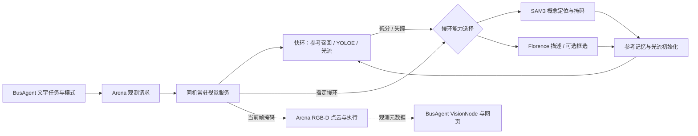

# Arena 图像链路

2026-09-06：已接通 YOLOE、SAM2 Tiny、LK 光流、SAM3 和 Florence 的按任务选择快慢环。SAM3 使用用户提供的权重；Qwen 多模态 API 仍为计划。图像不进入 BusAgent 的上层语言模型上下文。



## 数据与执行边界

Arena 在仿真线程冻结 RGB、深度、内参和外参，写入同机 `output/perception/<request_id>/`；后台线程仅向 `127.0.0.1:5570/observe` 发送观测编号。视觉模型读取 RGB，掩码保存到原目录，Arena 用同一帧的深度和位姿反投影。执行不查询配置类别和别名，目标直接由图像模型定位。仿真实例 ID 单独写入 `physical_instances.*`，只在模型定位后关联物理评测刚体，不作为识别答案或规划几何输入。Panda 的最终物理评测直接生成文字反馈，避免重复语言模型调用把放置失败改说成抓取失败，或附加旧机械臂的回位确认。

显式查询、场景查询和动作中的新观测沿设备适配节点发布 `perception.observed`，名义视觉节点生成 `perception.reported`，保留 task / correlation / causation 关联、当前环、模型来源、语义状态、回退原因和耗时。推理不等待消息总线逐帧分发。原始图像、深度、掩码和视觉嵌入不经总线传输；上层对话模型只得到本次任务完成的文字结果，快速接话阶段不读取上一目标的旧观测。

单个视觉服务串行复用 GPU 模型，Arena 底层控制继续运行。最多一个跟踪请求在途，不排队积压旧帧。连续跟踪只传 RGB 文件，返回后删除临时帧文件；需要点云的正式观测保留 RGB-D 文件作为开发证据。

## 路由

| 输入 | 实际行为 |
|---|---|
| 普通目标查询 `vision_mode=auto` | 有效 LK 跟踪；否则先参考召回／YOLOE 文本检测；失败再 SAM3 |
| 只用快环 `vision_mode=fast` | 跟踪／YOLOE，失败返回未找到 |
| 指定 SAM3 `vision_mode=slow, slow_provider=sam3` | 直接概念检测与分割，已有掩码不再运行 SAM2 |
| 可选 Florence 定位 `slow_provider=florence2` | 框选后 SAM2；语义保留为候选，不宣称类别被独立确认 |
| 场景快速清单 `scope=scene, scene_mode=inventory` | 每视角一次 YOLOE 批量查询配置词汇 |
| 场景描述 `scene_mode=describe` | 快速清单加每视角一次 Florence 区域描述 |
| 持续跟踪 `tracking=true` | 首次定位后按新帧更新；不驱动 Panda 随目标移动 |

SAM3 和 Florence 是独立可选路径，没有固定串行模型阶梯。SAM3 未找到目标时允许返回未知，不强迫 Florence 补框。场景清单不是任意类别穷举；配置词汇只是搜索提示。当前权重支持 YOLOE 文本和视觉提示，未另装无提示全类别权重。

`configs/arena_panda.json` 设置 YOLOE 接受阈值 0.45、SAM3 阈值 0.4、SAM2 每 8 次跟踪按需刷新、跟踪最大帧间隔 90。每 8 个仿真步尝试新观测，实际频率取决于仿真与推理速度。连续丢失后只触发一次慢环恢复，之后快环继续搜索；新查询可再次发起完整定位。新任务与停止均结束旧的显式跟踪，迟到结果按命令编号丢弃。

## 视觉记忆

复用 `ObjectMemoryStore` 保存多视角参考、语义来源和更新时间。Arena 参考为 PNG 无损全帧加原坐标目标框；保留背景几何供 YOLOE 提取视觉提示，避免裁剪改变目标尺度。JPEG 参考会损伤当前 20–40 像素目标的细节，黄色物体实测匹配分数由原始像素的 0.46/0.51 降到 0.39/0.34，因此新路径改用无损保存，阈值不降低。

同一标签、同一相机更新最近参考，YOLOE 缓存文本和参考嵌入，光流使用当前帧掩码。查询 `/memories` 可看记忆元数据，`POST /forget` 的 `{"label":"…"}` 删除匹配记忆及跟踪状态。旧裁剪记忆仍可读。此处是参考复用，不更新模型权重，也不保证任意姿态或跨场景实例身份。

Florence 框选没有可比较的类别置信度，保留 `candidate`；YOLOE 匹配该参考或 SAM2 给出高质量掩码，都不会把候选自动晋升为已确认类别。检测置信度、分割质量和光流质量分别记录。

## 相机与运动

相机保持两侧斜视和偏置腕部视角。普通定位使用两个固定视角，持物点云优先腕部；腕部失效时再查固定视角。点云使用掩码内部像素及冻结时的外参，减少边缘混合深度。

AnyPlace 的支撑区域点云属于精细语义几何任务，直接由 SAM3 提供掩码，以排除目标框内的其他物体；持物近景仍优先快环。录制腕部图像中 SAM3 未检出黄色圆柱，而 YOLOE 加 SAM2 可用，不能假定慢模型在每种视角都更强。

视觉查询与抓放执行均不要求配置标签；模型掩码定位后自动关联仿真刚体进行评测。普通运动继续快速 Panda 抓放优先，复杂或失败后 GraspGenX / AnyPlace 增强，Arena 执行 IK 与物理评测。独立 `place_held` 可续用前一命令的已验证夹持。VLA 未加载；任意移动目标的机械臂视觉伺服、悬挂、插入尚未接通。

## 部署

```bash
python3 ops/arena_stack.py start vision arena busagent
curl http://127.0.0.1:5570/health
curl http://127.0.0.1:5570/memories
```

视觉环境使用 `_envs/vision`，复用已部署 Florence 缓存与 CUDA torch。`run_arena_vision.sh` 设置 Isaac Python 动态库路径及本地权重路径。SAM3 位于 `_models/sam3.pt`；YOLOE 文本编码器位于 `_models/mobileclip2_b.ts`，根目录保留供官方加载器使用的符号链接。运行时不临时下载模型。

SAM2 源码 `_vendor/sam2`，权重 `_models/sam2/sam2.1_hiera_tiny.pt`。SAM3 通过已安装 Ultralytics `SAM3SemanticPredictor` 加载，以 `quantize=16` 和 FP16 autocast 推理。新增依赖为 timm 1.0.29、ftfy 6.3.1、wcwidth 0.8.3；完整已部署版本及权重 SHA256 见 [版本记录](arena/versions.json)。这是服务器环境记录，不能直接把旧 Windows `requirements-vision.txt` 当成该环境的锁文件。

## 验证

冻结真实相机画面可复跑：

```bash
python3 scripts/validate_vision_loops.py \
  --frames output/perception/<已保留观测编号> \
  --output output/vision-loop-validation.json
```

覆盖快环检测、SAM3 自动回退、SAM3 掩码交回光流、跨帧重新召回、不存在目标、快速清单及 Florence 描述。首次运行包含预热；后续运行可能命中已有参考，因此自动路径的具体阶段以记录为准。光流用重复冻结帧验证接管逻辑，不代表运动跟踪基准。实际 BusAgent 和抓放回归另记在验证数据中；单次场景回归不能代表工业任务成功率。

官方接口依据：[YOLOE](https://docs.ultralytics.com/models/yoloe/)、[SAM3 SemanticPredictor](https://docs.ultralytics.com/models/sam-3/)、[SAM2](https://github.com/facebookresearch/sam2)。

本轮数据见 [视觉与 BusAgent 验证记录](arena/vision-loop-validation.json)。

| 场景 | 实测耗时与结果 |
|---|---|
| 双视角快速清单 | 0.22 秒，红方块、黄色物体、蓝垫 |
| 双视角 SAM3 定位，已预热 | 0.29 秒 |
| SAM3 后双视角光流接管，冻结帧重放 | 0.029 秒 |
| 黄色圆柱磁盘参考召回及分割 | 0.47 秒 |
| 实际单相机连续光流更新 | 0.013 秒，跟踪期间末端位置变化为 0 |
| BusAgent 场景问答 | 输入至最终回答约 4.98 秒，包含任务理解和回复 |
| 红方块快速抓放 | 19.24 秒，物理验证通过，距垫中心 1.24 毫米 |
| 黄色圆柱增强抓放，空垫 | 39.90 秒，物理验证通过，距垫中心 23.89 毫米 |
| 黄色圆柱增强抓放，垫上已有红方块 | 41.98 秒，放置未通过验证；保留失败记录 |

空垫成功与占用场景失败不是同条件对照。语义支撑掩码修复已有离线几何验证，尚未据此验证占用场景的碰撞处理。毫米级精确整理与复杂接触任务仍需后续工作。

### 多候选复核修复（2026-09-06）

YOLOE 对 `green block` 曾同时框出绿色方块和“方块＋蓝色底板”，两个高分候选触发了直接返回歧义的旧分支。自动模式现将 `multiple_fast_candidates` 交给任务选择的慢环定位器（当前为 SAM3）复核；只有慢环仍返回多个实例才报告歧义。显式仅快环模式仍如实返回候选不确定。每次文本检测保存候选框及分数，便于区分重复框、整体区域和真正的多个物体。SAM3 的唯一结果保存为视觉参考，下一帧继续光流／SAM2 跟踪，不固定调用 Florence。

原始失败帧 `e8a082f63e704e8f9d99395fcd92c40d` 回放通过；同一现场 `green block` 查询及从蓝色底板抓放到桌面的物理任务也通过，完整抓放约 20 秒。
