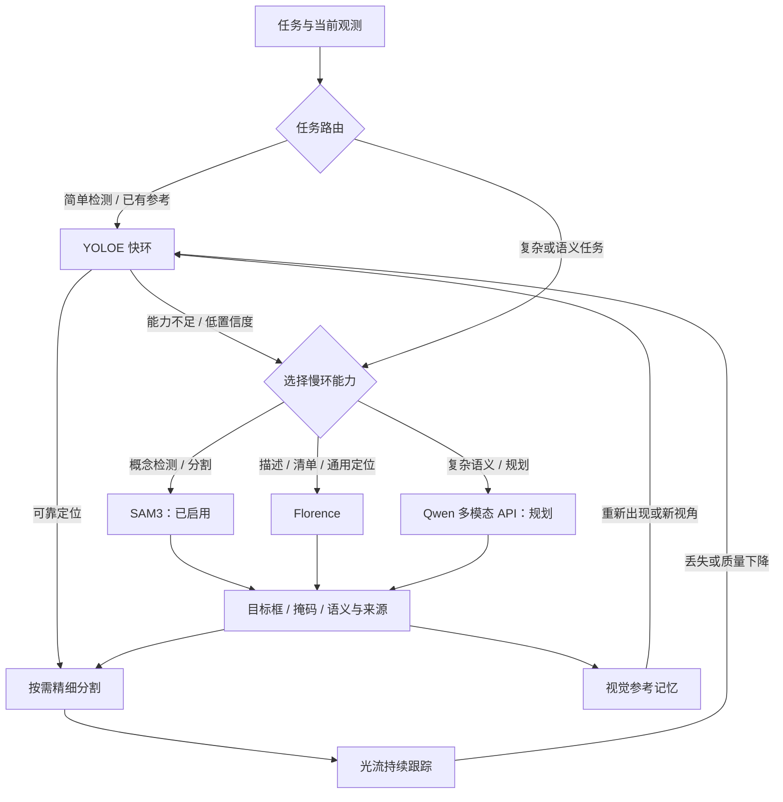

# 项目统一快慢环设计

2026-09-06，依据用户的架构澄清。本文记录 Arena Panda 当前实现及剩余边界。

## 共同原则

BusAgent 负责任务语义、能力选择和结果关联。视觉与运动各有自己的快慢环。简单任务优先快环；复杂任务可直接进入适合的慢环；低置信度、跟踪丢失或执行失败触发相应回退。慢环产出可复用结果后交回快环，不要求所有任务依次运行所有模型。

视觉推理相对 Arena 控制线程异步执行，慢环期间 Arena 继续底层控制。当前视觉服务共用 GPU 模型实例，串行处理推理请求；一个慢环请求期间不会并发运行另一帧快环，也不积压旧帧。YOLOE 分类分数、SAM 掩码质量和光流质量分别解释，不能直接比较或当作相互独立的类别验证。恢复失败允许返回未知，不无限循环，也不继续使用已失效的目标位置。

## 视觉入口与回退选择

| 任务 | 首选路径 | 能力不足时 |
|---|---|---|
| 常见目标、明确标签 | YOLOE 独立文本检测 | 路由至适合的慢环 |
| 已有目标参考 | YOLOE 视觉提示再识别 | 慢环重新定位、更新参考 |
| 相邻帧连续跟踪 | 光流；按需刷新 YOLOE／SAM2 | 重检测，仍失败再回慢环 |
| 开放标签／概念检测与分割 | 简单概念可先 YOLOE；困难概念可直接 SAM3 | 根据失败原因换模型或返回未知 |
| 描述场景、物品清单、通用视觉问答与框选 | Florence | 未来复杂语义模型或返回未知 |
| 复杂语义、细节理解、场景与任务规划 | 未来 Qwen 多模态 API | 结合定位模型与当前执行证据继续规划 |

SAM3、Florence、未来 Qwen 是慢环中按能力选择的节点；**没有固定的 YOLOE → SAM3 → Florence → Qwen 顺序**。SAM3 的概念检测可以直接接替 YOLOE，不需要再经过 Florence。Florence 的零样本定位仍可作为另一条可选路径。

快环不是每帧固定串联三个模型。当前 YOLOE 适配器输出框，首次定位使用 SAM2 Tiny 得到掩码；SAM3 已提供掩码时直接使用。SAM2 同时支持图像和视频传播，并非只能分割单张图；当前低成本连续跟踪优先复用光流。

YOLOE 可独立检测，不依赖 Florence 先给框。但文本／视觉提示模型与无提示模型须按权重区分。当前 `yoloe-26x-seg.pt` 不能直接等同于已启用无提示全场景盘点；无提示入口需要相应模型变体。配置中的类别词汇可以作为查询提示，不能直接当作观测清单。

## 视觉记忆与交回快环

1. 慢环在当前帧提出目标框／掩码，保留查询、语义、相机、帧编号及模型来源。
2. 只有框时，由 SAM2 在当前帧得到精细掩码；已有可用掩码时直接初始化快环。
3. Arena 保存无损 PNG 全帧和原坐标目标框，供 YOLOE 视觉提示在后续画面再识别；光流接管相邻帧跟踪。当前参考框覆盖的小目标约 20–40 像素，实测 JPEG 压缩会降低召回分数。旧模块仍可读取已有裁剪记忆。
4. 遮挡后重现、视角变化或新会话先检索视觉记忆，YOLOE 匹配成功后回到跟踪；失败则重新检测或选择慢环。
5. 临时候选与长期记忆分开记录，长期参考保留验证来源并可更新、遗忘。一次慢环错误不能靠反复匹配自己的模板自动变成可靠类别知识。

这是无需更新权重的视觉记忆与在线适配，不等于模型训练。单张参考不保证任意姿态下的识别，也不等于稳定的跨场景实例身份。不同模型输出不一致时保留不确定性，而非强行合成成功。

## 运动环

- 普通抓放：复用现成 Panda 简单算法。
- 复杂抓取／快速算法失败：GraspGenX 根据新观测生成抓取姿态。
- 复杂放置：AnyPlace 根据物体与目标区域几何生成放置姿态。
- 慢环生成姿态后仍由 Arena 负责 IK、轨迹执行、夹爪、任务管理与评测，不新增自研机械臂控制。
- 视觉慢环和运动慢环分别选择：目标难识别不必自动调用 AnyPlace，姿态复杂也不需要每帧调用 Florence。

## BusAgent 与图像边界

沿既有任务事件传递任务关联、观测引用、当前环、切换原因、模型来源、结果状态与耗时。实际图像推理由同机服务直接调用，不要求所有图像帧绕行消息总线。

RGB、深度、掩码、裁剪与视觉嵌入留在本地。上层语言模型只接收本次完成观测的文字结果。并行接话阶段不读取上一目标的视觉清单来回答当前场景。Qwen 多模态 API 未来接入属于单独的图像调用路径，本轮不发送图像至该 API。

## 已接通的路径

- YOLOE 独立文本检测已启用，类别嵌入和视觉提示嵌入分别缓存。默认检测阈值 0.45，不通过降低阈值强迫识别。
- 默认自动路径：有效光流 → 已有视觉参考／YOLOE 文本检测 → 低置信度或未找到时 SAM3。指定慢环时可直接使用 SAM3 或 Florence，不强制先跑所有模型。
- SAM3 权重已由用户提供并启用，概念检测阈值 0.4，FP16 推理。SAM3 没找到目标时返回未找到，不强制让 Florence 补一个框。
- 场景清单先用 YOLOE 批量查询配置词汇；描述请求额外对每个视角调用一次 Florence 区域描述。配置词汇是查询范围，清单不是全类别穷举。
- SAM3 框／掩码保存参考后进入光流快环。Florence 通用框选保留为 `candidate`，视觉模板再次匹配也不会自动晋升为类别已确认。
- 持久记忆复用已有 `ObjectMemoryStore`，支持多视角、更新、召回和遗忘；常驻跟踪状态最多保留 24 组。当前每个标签、每台相机保留最近一张参考，不能保证任意新视角下都能召回。
- BusAgent 下发视觉模式并关联观测事件，网页显示当前环、语义状态、观测年龄、回退原因及推理耗时。图像不进入上层对话模型。
- 显式“持续跟踪”仅启用视觉跟踪；新命令或停止结束旧跟踪。每 8 个仿真步尝试获取新帧，最多一个请求在途。丢失后尝试一次慢环恢复，持续无目标时留在快环搜索，避免不断调用慢模型。
- Qwen 多模态 API 仍只列计划。正式接入时核实实际 API 型号及能力，本轮没有发送图像或调用该 API。

实现细节与验证方式见 [Arena 图像链路](ARENA_VISION_PIPELINE.md)。运动环沿用现有 Panda 级联。任意新物体的视觉查询已与任务目录解绑，但可执行抓放与物理评测仍需要相应任务资产；悬挂、插入尚未接通。

官方能力依据：[YOLOE](https://docs.ultralytics.com/models/yoloe/)、[SAM2 图像与视频接口](https://github.com/facebookresearch/sam2)、[SAM3 概念提示能力](https://ai.meta.com/sam3/)。
