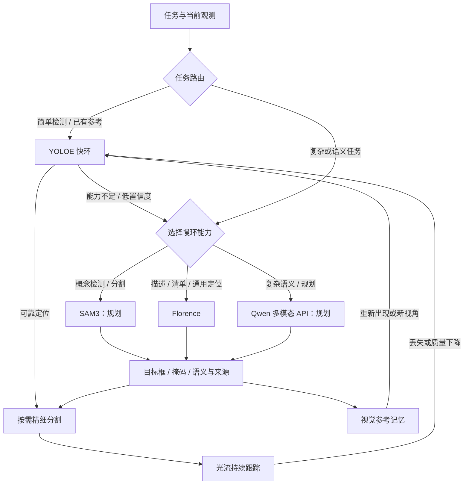

# 项目统一快慢环设计

2026-09-06，依据用户的架构澄清。本文是实施约定，已实现与待迁移项分别列出。

## 共同原则

BusAgent 负责任务语义、能力选择和结果关联。视觉与运动各有自己的快慢环。简单任务优先快环；复杂任务可直接进入适合的慢环；低置信度、跟踪丢失或执行失败触发相应回退。慢环产出可复用结果后交回快环，不要求所有任务依次运行所有模型。

慢环异步推理；快环继续处理仍有效的跟踪，Arena 继续底层控制。YOLOE 分类分数、SAM 掩码质量和光流质量分别解释，不能直接比较或当作相互独立的类别验证。恢复失败允许返回未知，不无限循环，也不继续使用已失效的目标位置。

## 视觉入口与回退选择

| 任务 | 首选路径 | 能力不足时 |
|---|---|---|
| 常见目标、明确标签 | YOLOE 独立文本检测 | 路由至适合的慢环 |
| 已有目标参考 | YOLOE 视觉提示再识别 | 慢环重新定位、更新参考 |
| 相邻帧连续跟踪 | 光流；按需刷新 YOLOE／SAM2 | 重检测，仍失败再回慢环 |
| 开放标签／概念检测与分割 | 简单概念可先 YOLOE；困难概念可直接 SAM3 | 根据失败原因换模型或返回未知 |
| 描述场景、物品清单、通用视觉问答与框选 | Florence | 未来复杂语义模型或返回未知 |
| 复杂语义、细节理解、场景与任务规划 | 未来 Qwen 多模态 API | 结合定位模型与当前执行证据继续规划 |

SAM3、Florence、未来 Qwen 是慢环中按能力选择的节点；**没有固定的 YOLOE → SAM3 → Florence → Qwen 顺序**。SAM3 的概念检测可以直接接替 YOLOE，不需要再经过 Florence。Florence 的零样本定位仍可作为另一条可选路径。

快环不是每帧固定串联三个模型。YOLOE 已有可用掩码时可以直接使用；需要更精细轮廓或点云时用 SAM2 Tiny。SAM2 同时支持图像和视频传播，并非只能分割单张图；当前低成本连续跟踪优先复用光流。

YOLOE 可独立检测，不依赖 Florence 先给框。但文本／视觉提示模型与无提示模型须按权重区分。当前 `yoloe-26x-seg.pt` 不能直接等同于已启用无提示全场景盘点；无提示入口需要相应模型变体。配置中的类别词汇可以作为查询提示，不能直接当作观测清单。

## 视觉记忆与交回快环

1. 慢环在当前帧提出目标框／掩码，保留查询、语义、相机、帧编号及模型来源。
2. 只有框时，由 SAM2 在当前帧得到精细掩码；已有可用掩码时直接初始化快环。
3. 保存目标裁剪、适量背景、框／掩码及多视角参考，供 YOLOE 视觉提示在后续画面再识别；光流接管相邻帧跟踪。
4. 遮挡后重现、视角变化或新会话先检索视觉记忆，YOLOE 匹配成功后回到跟踪；失败则重新检测或选择慢环。
5. 临时候选与长期记忆分开记录，长期参考保留验证来源并可更新、遗忘。一次慢环错误不能靠反复匹配自己的模板自动变成可靠类别知识。

这是无需更新权重的视觉记忆与在线适配，不等于模型训练。单张参考不保证任意姿态下的识别，也不等于稳定的跨场景实例身份。不同模型输出不一致时保留不确定性，而非强行合成成功。

## 运动环

- 普通抓放：复用现成 Panda 简单算法。
- 复杂抓取／快速算法失败：GraspGenX 根据新观测生成抓取姿态。
- 复杂放置：AnyPlace 根据物体与目标区域几何生成放置姿态。
- 慢环生成姿态后仍由 Arena 负责 IK、轨迹执行、夹爪、任务管理与评测，不新增自研机械臂控制。
- 视觉慢环和运动慢环分别选择：目标难识别不必自动调用 AnyPlace，姿态复杂也不需要每帧调用 Florence。

## BusAgent 与图像边界

沿既有任务事件传递任务关联、观测引用、当前环、切换原因、模型来源、结果状态与耗时。实际图像推理由同机服务直接调用，不要求所有图像帧绕行消息总线。

RGB、深度、掩码、裁剪与视觉嵌入留在本地。上层语言模型只接收本次完成观测的文字结果。并行接话阶段不读取上一目标的视觉清单来回答当前场景。Qwen 多模态 API 未来接入属于单独的图像调用路径，本轮不发送图像至该 API。

## 部署现状与实施顺序

本轮场景查询入口已与单目标查询分离，实际相机回归能找到红方块、黄色圆柱和蓝垫。**这尚不代表快慢环迁移完成**。

1. 恢复 YOLOE 独立检测优先。旧 `FindTrackPipeline` 有文本检测优先与记忆复用；Arena 的 `ImagePipeline` 仍是 Florence 首次定位，需复用旧能力。服务器文本编码依赖未完整，不能把静默回退 Florence 当作快环已经启用。
2. 把慢环改为按任务选择；替换场景清单临时逐标签运行 Florence 的串行做法。当前暂用 Florence 提供慢环能力，预留 SAM3 的独立选择，禁止将其设为 Florence 前的固定一步。
3. 迁移已有 `ObjectMemoryStore` 的多视角参考、召回、更新与遗忘到 Arena。临时跟踪状态不能冒充持久学习。
4. 总线和网页补齐当前环、回退原因、观测年龄与耗时。保留无目标、低分、遮挡、跨帧恢复和错误模板的回归。
5. 运动继续采用现有快慢级联，保持 Arena 负责实际执行。
6. **SAM3 暂不启用；Qwen 多模态 API 只列计划。** 用户拟用 `qwen3.8-max`，正式接入时核实 API 型号及能力，不在当前实现中假定已经可用。

验收：已知目标不调用 Florence；快环低分／丢失时记录回退原因；慢环定位后连续帧回快环；过期观测不能用于新动作；视觉参考在另一幅图像上重新定位；不存在的物体不被模板自匹配包装成已验证类别；全场景查询不复用上一单目标回答。

官方能力依据：[YOLOE](https://docs.ultralytics.com/models/yoloe/)、[SAM2 图像与视频接口](https://github.com/facebookresearch/sam2)、[SAM3 概念提示能力](https://ai.meta.com/sam3/)。
