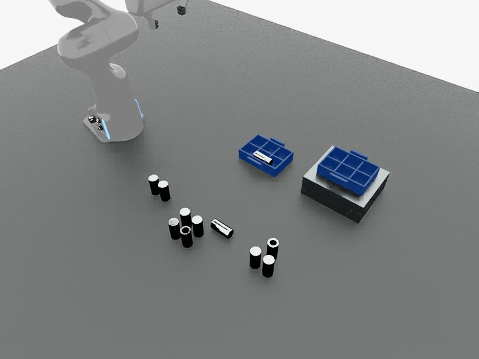

# 工业装箱场景实测审计

后续代码修改及新试验记录见 [工业闭环升级](INDUSTRIAL_UPGRADE.md)；本文保留修改前的审计基线。

测试日期：2026-09-07。结论：**当前版本不能完整完成答疑文件 Q8 的装箱、纠偏、满箱搬运和叠放流程。** 之前的普通托盘抓放验证不能代替这项验收。本轮新增场景和测试材料，没有把缺失的能力写成“已实现”。

## 文件强调了什么

来源为用户提供的《工业环境下物体感知识别与指令交互型智能体研发——答疑文件》，题号 XH-202607，共 4 页；文件 SHA-256 记录在 [验证数据](challenge-qa-validation.json) 中。

- **第 1 页 Q2：工业开放域感知和微调后的泛化。** 必须关注密集、堆叠、杂乱物品，不能只用几个彩色几何体或现成模型的普通演示证明泛化。
- **第 1 页 Q3：每个执行步骤后重新感知，并与预期目标比对。** 发现抓空、歪斜、掉落后，需要生成修正任务序列。每步需要核验，但文件没有要求每步都同步调用大语言模型。
- **第 1 页 Q4：重点是感知与决策。** 轨迹优化、力控没有硬性要求；动作失败后，能够自主识别并进行合乎逻辑的修正，仍可体现能力。因此当前优先补闭环和任务表达，继续复用 Arena 的 Panda/IK。
- **第 2–3 页 Q8：反光圆柱件，最多区域优先，正反姿态判断，装格、倾倒修复、满箱搬运、叠放。** 文件将其表述为具体例子，本项目按用户要求把它作为验收目标。“第二排第三格”在原文中属于更高阶任务。多执行机构是协同示例，不等于规定必须使用某种或某一数量的机械臂。
- **第 3–4 页 Q9：交付材料。** 包括推理与训练代码、权重与数据、可复现的仿真环境/场景、自然语言到任务序列的仿真视频、技术报告和使用说明。

## 测试方式与边界

在云服务器实际启动 Isaac Sim + IsaacLab-Arena + Panda，通过真实 BusAgent `intent.created` 事件提交任务；Qwen、YOLOE、SAM3、Florence 使用当前部署服务，没有使用模型返回值 mock。任务只收到自然语言、实际相机图像和模型观察；区域计数与正反状态的仿真真值单独保存，未提供给规划器。执行层仍使用现有仿真实例关联与接触反馈，本轮不声称这是脱离仿真真值的实机迁移测试。

为先定位断点，建立一个缩小的代表性场景：三个来料区域分别 **2、5、3 件**，包含倒置与横倒的反光盲孔圆柱件；一个 **2×3 格**可移动料箱中预置一件横倒零件，旁边高台上有第二个可移动料箱。它不是官方照片的完整规模复刻，也不是多随机种子统计基准。当前版本在这个更小的场景中已经阻塞，因此尚不具备宣布原场景通过的依据。

[另一相机视角](challenge-qa-side.jpg)。相机为现有 800×600 配置。部分竖直零件的检测框宽度仅约 14–20 像素，端面细节更小；后续应按需使用近景/更高原生分辨率的区域观察，不能靠放大低分辨率截图恢复细节。

## 实测结果

表中耗时统一采用服务端目标 `created_at → updated_at` 的时间。前三项客户端观察到阻塞分别为 101.48、84.84、153.72 秒，包含提交/轮询延迟；第四项测试观察器中途重新接入，因此不用接入后的轮询时长冒充完整任务耗时。每项仅跑一次，视觉记忆在同一会话中保留，结果不是成功率或延迟分位数。

| 用例 | 实际结果 | 服务端耗时 | 已返回的 LLM 调用 | 断点 |
|---|---|---:|---:|---|
| 零件最多的区域装箱，闭口端朝上，倒了自行纠正 | blocked；未进入抓放运动 | 100.16 s | 8 | 快速清单漏掉零件；SAM3 找到多个候选后返回目标不唯一；随后模型超时 |
| 放入来料料箱第二排第三格，闭口端朝上 | blocked；未进入抓放运动 | 83.71 s | 3 | 两个料箱候选没有落实为指定实例，随后模型超时 |
| 没装满先装满，再搬到高台料箱上叠放 | blocked；未搬箱 | 152.44 s | 11 | 先后卡在零件和料箱选择；连续恢复没有进展 |
| 单独扶正料箱里的横倒零件 | blocked；未执行扶正运动 | 113.89 s | 8 | 复杂文字提示未找到目标；改 SAM3 后仍多候选；恢复再次回到文字提示，随后超时 |

四项的独立真值诊断均为 **0 个满足中心位置与闭口端朝上条件的格位**，料箱未满。这个诊断只检查位置和轴向，不是完整接触/净空验收器。后三段装满、实际搬运、叠放的物理效果没有被前面的流程带到，不能据此断言“Panda/AnyPlace 一定搬不了”，也不能报告它们通过。

### 已经有效的部分

- 任务确实进入了 BusAgent 持久任务队列，规划器和监督器产生了执行与恢复步骤。
- 规划器会主动读取图片；在快速视觉不足时，监督器确实自主选择过 SAM3。
- 同类候选具有可执行的视觉引用。搬运用例中监督器曾选出一个实际零件引用，随后卡在目的料箱选择。
- 本轮没有把上述失败报告成物理成功。

### 具体问题

1. **集合发现与单目标消歧混在一起。** 首次快速 inventory 用时 2.77 秒，只列出 table，没有列出工业件。Florence describe 给出的是机械臂、蓝黑物体的概括描述，不能支持区域计数。SAM3 在装箱用例的主视角给出 11 个候选、侧视角给出 9 个候选，但其中有误检和跨视角重复，不能把候选数量当真值计数。`perceive target` 仍进入必须选定单体的路径，返回 `TARGET_AMBIGUOUS`。查找“所有零件”本应返回集合；抓某一件时才需要实例选择。移除这里不合适的失败条件，不代表抓取阶段可以忽略真正的歧义。

2. **LLM 看懂关系后，缺少可靠的空间落地工具。** 当前可复制既有 `obs:...` 引用，但没有把看图选出的区域/像素框直接变成当前帧 SAM2 实例的工具，也没有多视角去重后的区域计数、料箱格网和占用状态。因此又回到给分割器输入“蓝箱里的横倒金属件”之类长提示，导致无效恢复。

3. **动作接口尚不能表达这项任务的关键条件。** `ManipulationRequest` 目前有物体/目的地引用、粗区域和空位偏好，但没有格位引用、行列约定、闭口端朝上、容器容量/内容物状态等契约。文字 summary 写“扶正”不意味着底层收到旋转要求。本轮修复用例的初始规划还将扶正归为普通 `pick_place`，`review_after=false`；后续监督方案的 completion 描述变成了“放入格子”，丢掉了朝向要求。顶层原始 completion 文本仍保留，但缺少可计算的验收谓词来保证每个修正方案遵守它。

4. **当前物理成功条件不覆盖任务成功条件。** `PandaTask.evaluate` 检查抬升、释放、支撑接触、位置稳定和速度，没有核验零件朝向、指定格位、格子是否正确占用、料箱是否装满。稳定放反的物体不能算本任务成功。Bus 当前根据执行结果和 `review_after` 决定继续/监督，没有对每次动作都自动生成“新图像 + 任务谓词对比”的验收结果。

5. **复杂场景的上下文与回退成本仍过高。** 已返回请求中的最大 prompt token 数分别为 29,776、20,530、37,801、39,688。日志确认装箱和扶正中主模型 Qwen3.7-plus 与备用 Qwen3.8-max 均发生约 20 秒请求超时；不能仅据 token 数断言超时全由上下文造成，但上下文重复膨胀是已测出的负担。对目标歧义的失败，当前还会先后进入 basic/models 两条路径并重复定位；切换抓取模型不能消除这类歧义。搬运用例最终触发无进展恢复预算。预算需要保留，先改恢复策略，不应简单无限重试或全局加长超时。

6. **GraspGenX/AnyPlace 没有替代业务闭环。** 当前接入向模型请求抓取/放置候选，再做现有几何/IK 检查；没有向 AnyPlace 传递“第几格、哪一端朝上、先装满”等任务条件的完整桥接，也没有由这两个模型承担任务级失败检测和持续执行。本轮均在定位阶段被阻塞，没有测试出这两个模型在该夹杂料箱场景中的真实物理成功率。

7. **训练泛化和多执行器还有交付缺口。** 本轮在项目主代码中未找到工业数据微调及独立测试集泛化验收的证据。现有视觉记忆明确记录 `weight_training: false`，属于视觉提示复用，不能当作参数微调成果。当前是一台 Panda 的串行运动执行；Bus 中多个软件节点不能直接证明 A/B 装箱、C 搬运的多执行器协同效果。

对应源码：`source/mr_liu/arena/runtime.py`（cloud/locate/放置调用），`contracts.py`（请求契约），`environment.py`（PandaTask.evaluate），`source/mr_liu/perception/arena_vision.py`（视觉记忆），`BusAgent/backend/src/apps/desktop-robot/intelligence/{planning,planning-context,task-engine}.ts`（规划、上下文、结果流转）。本次运行的文件哈希与两仓库 HEAD/dirty 状态在验证 JSON 中，不能仅用 HEAD 代表本次未提交工作区。

## 解决顺序与验收标准

### 第一阶段：让“看见并选择”成为有结果的操作

把集合发现 `find_all` 与实例选择 `resolve_one` 分开；多候选正常返回。用掩码、深度、跨视角几何与跟踪 ID 建立当前可见实例集合，计算区域数量/置信度，避免一件物体被两台相机计两次。允许 VLM 提交当前图像的区域框，交给 SAM2 精化并生成真实引用；有引用时优先重新定位该实例。类别交给检测器，区域/包含/朝向关系交给空间处理。

通过条件：在本场景中找出 2/5/3 区域与最多区域，两个料箱分清用途；多目标集合不再变成程序拒绝；看不清时能发起有效的近景观察。进一步换零件、布局、光照后再做统计，不能把这三个数字写进运行逻辑。

### 第二阶段：表达格位、朝向与可验证目标

扩展几何任务契约，例如 `cell_ref`、`orientation_constraint`、`expected_postconditions`。格位由识别到的料箱局部坐标系/格网生成，明确从哪个方向计行列；物体“闭口端”由图像特征和 RGB-D 姿态估计绑定到物体轴，不能按配置资产名称认定。原始任务条件持续保留，修复步骤不能把它简化掉。

放置候选必须同时满足目标格位、端面方向、净空和可达性。复用简单几何法/AnyPlace 生成候选与 Arena IK 执行；姿态不可直接达到时生成调整持物或中间重抓步骤。格位必须按零件和夹爪实际尺寸验算，不能通过把仿真物体传送到目标位置证明成功。

通过条件：普通件入格、倒置件翻正、指定第二排第三格各有独立验收；横倒/错误格位被判失败，即使物体已稳定也不能报完成。

### 第三阶段：每步快速核验，异常才升级监督

动作完成后抓取新 RGB-D，结合夹爪开度/接触/速度等执行反馈，输出 `grasped / correct_cell / correct_orientation / stable / fell / uncertain` 等结构化证据。先由快速核验更新队列；只有不确定、阶段切换或失败时调用监督 LLM。非依赖感知和下一步候选预计算可以与运动并行，最终提交必须用足够新的观测确认。

针对不同失败改变策略：定位歧义→选引用，遮挡→换视角，抓空→重定位/换抓姿，姿态错→翻正/重抓，格位占用→重新选格。LLM 只接收最新状态摘要与引用，完整候选和日志留在 Bus 的证据存储，按需读取。恢复预算按是否增加新信息、是否取得物理进展判断，避免在不同模型之间重复同一次无效定位。

通过条件：人为引入一次抓空、放反、倾倒和格位占用，系统都能识别并排入具体纠正步骤；正常动作不每次等待 LLM。分别记录动作耗时、感知等待、LLM 等待、恢复次数和 token/API 成本。

### 第四阶段：满箱与搬运协同

维护料箱格位占用、正确装入数量、内容物成员与状态。只有满足装满条件才切换为搬箱目标；抓取料箱时持续判断内容物是否掉落，释放后核验叠放支撑与稳定。先用单 Panda 在可达范围内完成整段，再扩展 Bus 任务/料箱/工作区资源的分配和租约，实现 A/B 装箱、C 搬运。

通过条件：未满时继续装；装满后搬到指定区域并叠放；搬运掉件时检测和恢复。多执行器演示单独测试，不用多个软件 agent 的日志替代机械执行结果。

### 第五阶段：工业泛化与参赛交付

利用仿真生成多反光材质、照明、遮挡、堆叠和未知零件数据，分开训练/验证/测试，尤其保留未见零件与未见布局。补训练或微调脚本、权重来源、数据说明和可复现评测。记录检测/分割、区域计数、正反姿态、格位占用、自动修复和任务完成的指标；同时报告速度与失败案例。准备锁定依赖的环境/容器、场景脚本、完整运行视频和文档。当前新场景只是这个过程的测试起点。

## 复现与本轮结束状态

- 场景构建：`python scripts/build_challenge_qa_fixture.py`（Python 需有 USD/pxr，项目 `.venv` 已用于构建）。
- 配置：`configs/arena_panda_challenge_qa.json`；资产在 `assets/scenes/challenge_qa/`。`audit_truth.json` 仅供离线评测，禁止注入规划上下文。
- 启动该场景后运行：`python scripts/audit_challenge_qa.py baseline`，随后按需运行 `packing`、`slot`、`carry`、`repair`。脚本默认访问云机内部端口；本地隧道使用 `--arena http://127.0.0.1:37862 --bus http://127.0.0.1:33101`。每次使用不同 `--output` 保存记录，超时会暂停本次目标。
- 完整本轮任务与事件记录：`output/challenge-qa/20260907/`；摘要：[challenge-qa-validation.json](challenge-qa-validation.json)。第四项观察器首次遇到事件已接收但队列尚未落盘的时间差，重新接入同一目标，无重复提交；永久脚本已处理该异步时间差。
- 本轮保留上述测试场景在云端，四个失败目标保留 blocked 状态供查看。机械臂 idle、无持物，未留下活动任务。原场景指针备份：云端 `output/deployments/qa-audit-scene-before.json`。
- 新增内容仅为场景、审计脚本和材料；没有以降低验收条件或修改检测输出的方式让测试变成成功。
