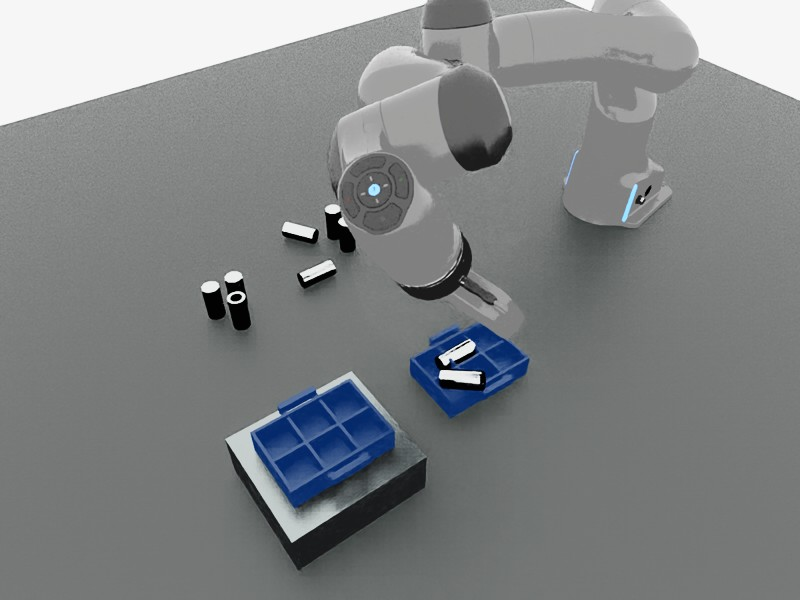
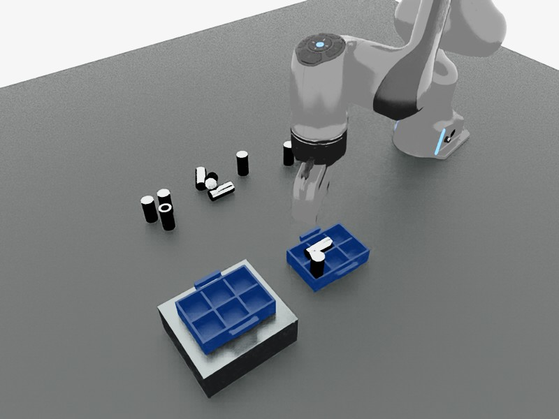

# 工业闭环升级：首批实现与验证

2026-09-07。基线审计与后续顺序见 [CHALLENGE_QA_AUDIT.md](CHALLENGE_QA_AUDIT.md)。本文记录代码已经改变的部分，不替代 Q8 全流程验收。

## 修改前版本

两个仓库均已提交并推送标签 `checkpoint/pre-industrial-closed-loop-20260907`：

- Arena：`dfeedff90aca37a65466bb92da2c9ec657244734`
- BusAgent：`1bbad512a2e5942fe380052b370dae49f24ca6ba`

本地与云端有对应 Git bundle 和 manifest，位于 `output/checkpoints/pre-industrial-closed-loop-20260907/`。云端另存数据库与运行配置的私有快照；这些文件不进入 Git。该标签保存的是原审计中 Q8 失败的真实状态。

## 已实现的接口

1. `perceive` 按类别默认返回集合。YOLOE/SAM3 多候选正常返回；SAM3 的掩码直接复用，SAM2 同帧图像编码复用。跨相机几何关联保留同帧邻近实例，输出当前实例引用、可见数量和空间邻近分组。计数不表示无遮挡完整清单。
2. BusAgent 新增 `observe_objects`、`ground_region`、`inspect_object` 和 `read_observation`。VLM 读到的是有编号的原始同步图像，可将其框选交给 SAM2 精化为可执行引用。图像/掩码不进入 Bus 消息正文，按需读图时图像才进入该次多模态模型请求。
3. `inspect_object(kind=grid)` 从 RGB-D 识别水平规则料箱的格网、参考相机下的行列和占用，返回实际 `cell_ref`。每个视角分别拟合格网，所有视角共同检查占用；遮挡时可复用此前实测格网，但必须由当前可见深度确认容器几何未移动；空位需要正向的底面可见证据。遮挡返回 unknown，不把未知变成空位。
4. `pick_place` / `place_held` 可传 `destination: {cell_ref: ...}`。执行重新观察容器和格位，检查当前物体尺寸；快算法在竖长件入格时提高夹持点，让手指避开矮隔板。增强路径筛选 AnyPlace 候选时同样保留格位约束。
5. 指定格位的物理评测检查放入位置、载物轮廓、落底、支撑、释放和稳定。使用的是视觉测得的格位与物体形状；仿真真实刚体姿态只作为执行结果的独立评测证据，不用于生成视觉掩码或语义名称。
6. 动作后保存新 RGB-D 快照。普通动作不因此增加 LLM/图像模型调用；入格动作额外快速观察格位占用。物理动作完成但视觉证据不确定时，Bus 保留 completed 动作并进入 review，不重放已经完成的抓放。
7. 历史任务上下文只保留状态、原始目标、失败、物理评测和证据编号。完整观察留在证据存储，按需读取。定位失败不会再自动切换抓取模型重复定位。纯观察任务可以正常结束，不必生成机械运动。

`inspect_object(kind=axis)` 已能返回长轴及两端的图像位置；**指定端点翻正执行尚未实现**。接口遇到端点翻转要求会明确返回能力缺口，不静默忽略该参数。PCA 长轴本身也不能判断哪端是闭口。

## 云端实测证据

证据原件位于 `output/industrial-upgrade/`。均使用实际 Isaac Sim、SAM3/SAM2 和 BusAgent/Qwen 服务；下面的单项耗时不是成功率或延迟分位数。

- SAM3 零件集合：首轮约 0.96 s；来料区域得到 5/3/2 分组。仍有一次夹指误检、漏掉箱内横倒件，因此没有宣布完整清单正确。
- SAM3 两个蓝色料箱：首轮约 0.33 s。
- 读图后 SAM2 框选箱内横倒件：约 0.71 s，生成有效掩码与物体引用。框由测试者在实际图中选定，属于工具链验证，不冒充自主 VLM 定位成功。
- BusAgent 纯观察/选择：修复退出逻辑前 49.47 s blocked；之后 37.10 s completed、5 次模型调用，未移动机械臂。最大区域选择正确；夹指误检和料箱用途判断仍需改进，不能只按 completed 状态判语义全对。
- 格网：初次合并点云导致 irregular_or_occluded_dividers；改为各视角独立拟合后观察到 2×3 格网。首次执行前单视角续接导致空格 unknown，随后保留同一实例的多视角，并使用完整局部深度密度。失败记录保留，不降低空位判定来通过测试。

- 实际入格组件试验：basic 抓空，12.87 s 失败；auto 随后从快算法回退 GraspGenX，成功抬升约 0.158 m，但增强放置重观察漏传 grid，38.38 s 后保留持物并报失败。漏传参数现已修复。
- 独立 `place_held`：先因主视角被机械臂遮挡而无法重建格网；加入“当前几何确认 + 实测格网复用”后，16.22 s 完成运输、释放，实际零件横倒在隔板上，任务仍判失败。证明持物可以续接并放下，不等于入格已经成功。后续排查重点为抓姿、手指净空与实际 IK 到位；未把某一种碰撞原因当作已经证实。
- 根据这次试验继续修复：闭爪即记录持物参考，失败抬升后清除实测已丢失的持物标记；保留 fast 失败的物理评测与格位指标；释放前等待实际 Arena IK 到位。未到位时保留夹持并进入已有恢复路径。

最后一次真实 BusAgent 自然语言组件试验通过：**165.02 s，10 次 LLM 调用**。第一次抓取失败后，监督选择原最多区域的另一个实例并显式改用 enhanced；GraspGenX 抓取 16.71 s，独立放置 17.31 s。最终指定格位物理检查与新 RGB-D 占用检查均通过，中心误差 **0.97 mm**。本次为保持原朝向的单件入格，不是倒置翻正、连续装满或完整 Q8 通过。前面失败及横倒试验仍保留。

模型累计等待约 81.4 s，最大单次 prompt 17,924 tokens；仍需减少重复工具往返及当前轮次的重复上下文，不能宣布速度目标已达到。

本地相关 **69 项 Python 测试、35 项 BusAgent 测试**及 Nest 构建通过；具体结果见 [industrial-upgrade-validation.json](industrial-upgrade-validation.json)。

## 尚未通过的验收

闭口端识别与翻正、横倒件自动纠偏、完整装满后搬箱/叠放、多执行器协同和独立工业泛化数据集仍未完成验收。规则格网算法还需要更多不同尺寸、遮挡与布局测试。不能把单个入格接口或仿真接触反馈当作整套工业方案已完成。
